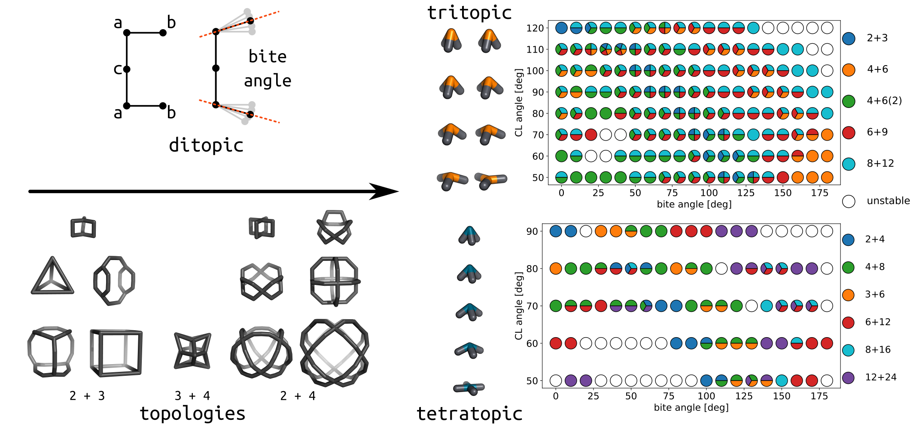

===============
Model dataset 1
===============

Exploring self-sorting outcomes and topology maps in cage-like molecules.

Publication: `Systematic exploration of accessible topologies of cage molecules via minimalistic models`__

__ https://pubs.rsc.org/en/content/articlelanding/2023/sc/d3sc03991a

Based on building block properties, we have defined accessible topology maps, which give an idea of what cage topology you are likely to get after self-assembly:

This is a simple interface where you can map the angles and building block connectivities of interest to stable topologies.

This covers ditopic + tritopic, ditopic + tetratopic and tritopic + tetratopic cage topologies.

**Go to Notion link**: `topology selection dataset v0.0.4`__

__ https://tarziaresearch.notion.site/actual-app-5a5b2f3c5a564fdeaf59c0752bf1ca6f

**Go to GitHub repository with structure and self-sort images**: `CGModel repositories`__

__ https://github.com/andrewtarzia/cgmodels/tree/main/cg_model_jul2023)

